# Pristha Digital MVP — Entity Dictionary & System Design Graph

This document serves as the canonical architectural map of the **Pristha Digital MVP** data layer. It bridges the physical PostgreSQL 17 schema (migrated via Flyway migrations `V0` through `V8`) and the Java JPA entity representations in the Spring Boot codebase.

---

## 1. Architectural Design Principles

The data layer is structured to balance transactional integrity with future microservice scalability:
1. **Schema & Module Isolation**: Each logical domain has its own PostgreSQL schema: `identity`, `tenant`, `studio`, `catalog`, `social`, `reading`, `billing`, and `analytics`.
2. **Modular Boundaries (No Cross-Schema Foreign Keys)**: References pointing across schema boundaries are modelled as plain `BIGINT` (Java `Long`) columns. Database-enforced foreign keys are used **strictly within a single schema** to prevent tight cross-module coupling. Integrity across schemas is maintained asynchronously via **Spring Modulith Event Publications** or service-level orchestration.
3. **Double-Entry Ledger Design**: All financial operations (`top-up`, `paywall unlock`, `withdrawal`) are modeled as debit/credit adjustments across balanced accounts. Volatile balances are stored in wallets, but audit logs are append-only ledger entries.
4. **Trigger-Driven Timestamps**: `updated_at` timestamps are managed directly by a PostgreSQL database trigger (`shared.set_updated_at`) rather than relying solely on Java lifecycle events, ensuring audit integrity regardless of database clients.

---

## 2. Part 1: Schema-by-Schema Entity Dictionary

### 2.1. Module: `identity`
Contains authentication, reader profiles, and author onboarding details.
* **Derived Roles**: Roles are not stored. If a user is `ACTIVE`, they are a `READER`. If they also have a record in `author_profiles`, they are also an `AUTHOR`.

| Entity (Java) / Table (SQL) | Field / Column | Java Type | SQL Type | Constraints & Defaults | Reason / Purpose |
| :--- | :--- | :--- | :--- | :--- | :--- |
| **`User`** / `identity.users` | `id` | `Long` | `BIGINT` | `GENERATED ALWAYS AS IDENTITY PRIMARY KEY` | Unique identifier for each user profile. |
| | `phone` | `String` | `VARCHAR(20)` | `NOT NULL UNIQUE` | Primary login identifier and destination for sending OTP verification codes. |
| | `fullName` | `String` | `VARCHAR(100)` | `NOT NULL` | Public display name of the reader/user across the platform. |
| | `passwordHash` | `String` | `VARCHAR(255)` | `NOT NULL` | Bcrypt/Argon2 password hash for login verification. |
| | `status` | `UserStatus` | `VARCHAR(30)` | `NOT NULL DEFAULT 'PENDING_VERIFICATION'` | Lifecycle state: `PENDING_VERIFICATION`, `ACTIVE`, or `SUSPENDED`. |
| | `email` | `String` | `VARCHAR(255)` | `NULL UNIQUE` (where not null) | Optional contact email for notifications and recovery. |
| | `avatarUrl` | `String` | `VARCHAR(512)` | `NULL` | Link to the user's avatar image. |
| | `bio` | `String` | `TEXT` | `NULL` | Optional reader biography. |
| | `createdAt` | `Instant` | `TIMESTAMPTZ` | `NOT NULL DEFAULT now()` | Registration timestamp. |
| | `updatedAt` | `Instant` | `TIMESTAMPTZ` | `NOT NULL DEFAULT now()`, `ON UPDATE` trigger | Last profile modification timestamp. |
| **`AuthorProfile`** / `identity.author_profiles` | `id` | `Long` | `BIGINT` | `GENERATED ALWAYS AS IDENTITY PRIMARY KEY` | Unique identifier for the author profile. |
| | `userId` | `Long` | `BIGINT` | `NOT NULL UNIQUE REFERENCES identity.users(id)` | Intra-schema FK; enforces 1:1 user-to-author mapping. |
| | `penName` | `String` | `VARCHAR(100)` | `NOT NULL UNIQUE` | Public pen name displayed on published books or posts. |
| | `biography` | `String` | `TEXT` | `NULL` | Detailed author biography shown on public author landing page. |
| | `payoutMfsNumber` | `String` | `VARCHAR(20)` | `NOT NULL` | Mobile Financial Service (MFS) number used to process payouts. |
| | `payoutMfsProvider` | `MfsProvider` | `VARCHAR(20)` | `NOT NULL CHECK (IN BKASH, NAGAD, ROCKET)` | Selected provider for payouts: `BKASH`, `NAGAD`, or `ROCKET`. |
| | `createdAt` | `Instant` | `TIMESTAMPTZ` | `NOT NULL DEFAULT now()` | Author profile creation timestamp. |
| | `updatedAt` | `Instant` | `TIMESTAMPTZ` | `NOT NULL DEFAULT now()`, `ON UPDATE` trigger | Last author settings modification timestamp. |

---

### 2.2. Module: `tenant`
Maintains client isolation. Although white-label domains and branding elements are deferred for the MVP, the multi-tenancy foundation is established.

| Entity (Java) / Table (SQL) | Field / Column | Java Type | SQL Type | Constraints & Defaults | Reason / Purpose |
| :--- | :--- | :--- | :--- | :--- | :--- |
| **`Tenant`** / `tenant.tenants` | `id` | `Long` | `BIGINT` | `GENERATED ALWAYS AS IDENTITY PRIMARY KEY` | Unique tenant identifier (Seeded to `1` for the "Pristha" default instance). |
| | `name` | `String` | `VARCHAR(100)` | `NOT NULL` | Display name of the tenant instance. |
| | `createdAt` | `Instant` | `TIMESTAMPTZ` | `NOT NULL DEFAULT now()` | Timestamp when the tenant was provisioned. |
| | `updatedAt` | `Instant` | `TIMESTAMPTZ` | `NOT NULL DEFAULT now()`, `ON UPDATE` trigger | Last tenant modification timestamp. |

---

### 2.3. Module: `studio`
The private workspace for authors where draft books, chapters, and posts are managed.

| Entity (Java) / Table (SQL) | Field / Column | Java Type | SQL Type | Constraints & Defaults | Reason / Purpose |
| :--- | :--- | :--- | :--- | :--- | :--- |
| **`Category`** / `studio.categories` | `id` | `Long` | `BIGINT` | `GENERATED ALWAYS AS IDENTITY PRIMARY KEY` | Unique category identifier. |
| | `name` | `String` | `VARCHAR(50)` | `NOT NULL UNIQUE` | Display name of the genre/category (e.g. 'Fiction', 'Poetry'). |
| | `createdAt` | `Instant` | `TIMESTAMPTZ` | `NOT NULL DEFAULT now()` | Category creation timestamp. |
| **`Writing`** / `studio.writings` | `id` | `Long` | `BIGINT` | `GENERATED ALWAYS AS IDENTITY PRIMARY KEY` | Unique writing identifier. |
| | `tenantId` | `Long` | `BIGINT` | `NOT NULL` | Soft reference to `tenant.tenants(id)` for tenant isolation. |
| | `authorId` | `Long` | `BIGINT` | `NOT NULL` | Soft reference to `identity.author_profiles(id)` for ownership. |
| | `parent` (field) / `parent_id` (col) | `Writing` | `BIGINT` | `NULL REFERENCES studio.writings(id)` | Intra-schema self-referential FK representing hierarchy (Chapter $\rightarrow$ Book). |
| | `title` | `String` | `VARCHAR(255)` | `NULL` | Title of the book, chapter, or post. |
| | `slug` | `String` | `VARCHAR(280)` | `NULL UNIQUE` (where not null) | URL-friendly identifier, generated and set at publication. |
| | `bodyJson` | `String` | `JSONB` | `NULL` | Structured content representation (rich text TipTap/EditorJS payload). |
| | `previewJson` | `String` | `JSONB` | `NULL` | Explicit teaser for `LOCKED` content. If `NULL`, content is auto-truncated. |
| | `type` | `WritingType` | `VARCHAR(30)` | `NOT NULL CHECK (IN BOOK, CHAPTER, POST)` | Content hierarchy level: `BOOK`, `CHAPTER`, or `POST`. |
| | `status` | `WritingStatus` | `VARCHAR(30)` | `NOT NULL DEFAULT 'DRAFT'` | Workflow state: `DRAFT`, `UNFINISHED_PREVIEW`, `PUBLISHED`, `COMPLETED`. |
| | `priceType` | `PriceType` | `VARCHAR(20)` | `NOT NULL DEFAULT 'FREE'` | Paywall configuration: `FREE` or `LOCKED`. |
| | `priceAmount` | `BigDecimal` | `NUMERIC(10,2)` | `NOT NULL DEFAULT 0.00` | Price in BDT. Enforced to be $\ge 1.00$ BDT if `priceType` is `LOCKED`. |
| | `orderIndex` | `int` | `INT` | `NOT NULL DEFAULT 0` | Ordering field for sorting chapters inside a book. |
| | `deletedAt` | `Instant` | `TIMESTAMPTZ` | `NULL` | Field for soft deletion (used to recover content within safety window). |
| | `createdAt` | `Instant` | `TIMESTAMPTZ` | `NOT NULL DEFAULT now()` | Timestamp when the draft was created. |
| | `updatedAt` | `Instant` | `TIMESTAMPTZ` | `NOT NULL DEFAULT now()`, `ON UPDATE` trigger | Last saved draft modification timestamp. |
| **`WritingCategory`** / `studio.writing_categories` | `writingId` | `Long` | `BIGINT` | `NOT NULL REFERENCES studio.writings(id)` | Part of composite PK. Connects writing to category mapping. |
| | `categoryId` | `Long` | `BIGINT` | `NOT NULL REFERENCES studio.categories(id)` | Part of composite PK. Connects category to writing mapping. |

---

### 2.4. Module: `catalog`
The public, read-optimized search index and feed system. It represents a denormalized projection of published data.
* **Shared PK**: `catalog.published_writings.id` is an *assigned key* matching `studio.writings.id`. No database FK exists between them.
* **Mirrored Strings**: Fields copy status, price types, and writing types from the Studio module. They are represented as plain Java `String` types instead of shared enums to maintain strict module boundaries (Spring Modulith doesn't allow reaching into other modules' internal enum packages).

| Entity (Java) / Table (SQL) | Field / Column | Java Type | SQL Type | Constraints & Defaults | Reason / Purpose |
| :--- | :--- | :--- | :--- | :--- | :--- |
| **`PublishedWriting`** / `catalog.published_writings` | `id` | `Long` | `BIGINT` | `PRIMARY KEY` (assigned key, matching `studio.writings.id`) | Shared key to avoid join query overhead when referencing core content metadata. |
| | `tenantId` | `Long` | `BIGINT` | `NOT NULL` | Soft reference to `tenant.tenants(id)`. |
| | `authorId` | `Long` | `BIGINT` | `NOT NULL` | Soft reference to `identity.author_profiles(id)`. |
| | `authorPenName` | `String` | `VARCHAR(100)` | `NOT NULL` | Denormalized pen name to avoid join overhead when generating feeds/search. |
| | `parentId` | `Long` | `BIGINT` | `NULL` | Soft reference to parent book ID (if a chapter). |
| | `title` | `String` | `VARCHAR(255)` | `NULL` | Public display title. |
| | `slug` | `String` | `VARCHAR(280)` | `NOT NULL UNIQUE` | URL identifier for public SEO routing. |
| | `synopsis` | `String` | `TEXT` | `NULL` | Book synopsis/summary for search card list displays. |
| | `coverImageUrl` | `String` | `VARCHAR(512)` | `NULL` | Public cover image artwork link. |
| | `previewJson` | `String` | `JSONB` | `NULL` | Copied teaser content for paywalled items. |
| | `type` | `String` | `VARCHAR(30)` | `NOT NULL` | Copied writing type (`BOOK`, `CHAPTER`, `POST`). |
| | `status` | `String` | `VARCHAR(30)` | `NOT NULL` | Copied writing workflow status. |
| | `priceType` | `String` | `VARCHAR(20)` | `NOT NULL` | Copied pricing strategy (`FREE`, `LOCKED`). |
| | `priceAmount` | `BigDecimal` | `NUMERIC(10,2)` | `NOT NULL` | Copied price in BDT. |
| | `orderIndex` | `int` | `INT` | `NOT NULL DEFAULT 0` | Copied sort ordering index. |
| | `likeCount` | `long` | `BIGINT` | `NOT NULL DEFAULT 0` | Denormalized count of likes; updated asynchronously by event listeners. |
| | `commentCount` | `long` | `BIGINT` | `NOT NULL DEFAULT 0` | Denormalized count of comments; updated asynchronously by event listeners. |
| | `publishedAt` | `Instant` | `TIMESTAMPTZ` | `NOT NULL DEFAULT now()` | Eventual publication timestamp. Drives feed sorting. |
| | — (Implicit SQL Column) | — | `TSVECTOR` | `GENERATED ALWAYS AS (to_tsvector('simple', ...)) STORED` | Full-text search vector combining title, synopsis, and pen name (uses 'simple' config to support Bangor/English mixed text). |
| **`PublishedWritingTag`** / `catalog.published_writing_tags` | `writingId` | `Long` | `BIGINT` | `NOT NULL REFERENCES catalog.published_writings(id)` | Part of composite PK. Links tag back to catalog index. |
| | `tag` | `String` | `VARCHAR(50)` | `NOT NULL` | Part of composite PK. Denormalized category names used for fast catalog filtering. |
| **`Follow`** / `catalog.follows` | `id` | `Long` | `BIGINT` | `GENERATED ALWAYS AS IDENTITY PRIMARY KEY` | Unique follow record identifier. |
| | `followerId` | `Long` | `BIGINT` | `NOT NULL` | Soft reference to `identity.users(id)` representing the reader. |
| | `authorId` | `Long` | `BIGINT` | `NOT NULL` | Soft reference to `identity.author_profiles(id)` representing the followed creator. |
| | `createdAt` | `Instant` | `TIMESTAMPTZ` | `NOT NULL DEFAULT now()` | Unique mapping constraint on `(follower_id, author_id)`. |

---

### 2.5. Module: `social`
Handles user engagement (likes and comments). Gated by eligibility checks (e.g. user must have unlocked the content) processed in the service layer.

| Entity (Java) / Table (SQL) | Field / Column | Java Type | SQL Type | Constraints & Defaults | Reason / Purpose |
| :--- | :--- | :--- | :--- | :--- | :--- |
| **`WritingLike`** / `social.writing_likes` | `id` | `Long` | `BIGINT` | `GENERATED ALWAYS AS IDENTITY PRIMARY KEY` | Unique like record ID. |
| | `writingId` | `Long` | `BIGINT` | `NOT NULL` | Soft reference to `studio.writings(id)` / `catalog.published_writings(id)`. |
| | `userId` | `Long` | `BIGINT` | `NOT NULL` | Soft reference to `identity.users(id)` representing the liking user. |
| | `createdAt` | `Instant` | `TIMESTAMPTZ` | `NOT NULL DEFAULT now()` | Unique constraint on `(writing_id, user_id)` (one like per writing per reader). |
| **`WritingComment`** / `social.writing_comments` | `id` | `Long` | `BIGINT` | `GENERATED ALWAYS AS IDENTITY PRIMARY KEY` | Unique comment record ID. |
| | `writingId` | `Long` | `BIGINT` | `NOT NULL` | Soft reference to `studio.writings(id)`. |
| | `userId` | `Long` | `BIGINT` | `NOT NULL` | Soft reference to `identity.users(id)` representing the author of the comment. |
| | `parent` (field) / `parent_id` (col) | `WritingComment` | `BIGINT` | `NULL REFERENCES social.writing_comments(id)` | Intra-schema self-referential FK for reply threads. |
| | `body` | `String` | `TEXT` | `NOT NULL` | Plain text comment body. |
| | `deletedAt` | `Instant` | `TIMESTAMPTZ` | `NULL` | Soft delete marker used to blank out text but preserve thread shape for replies. |
| | `createdAt` | `Instant` | `TIMESTAMPTZ` | `NOT NULL DEFAULT now()` | Comment timestamp. |
| | `updatedAt` | `Instant` | `TIMESTAMPTZ` | `NOT NULL DEFAULT now()`, `ON UPDATE` trigger | Last edit timestamp. |

---

### 2.6. Module: `reading`
Manages reader access grants and last-read offsets (bookmarks).

| Entity (Java) / Table (SQL) | Field / Column | Java Type | SQL Type | Constraints & Defaults | Reason / Purpose |
| :--- | :--- | :--- | :--- | :--- | :--- |
| **`ContentAccess`** / `reading.content_access` | `id` | `Long` | `BIGINT` | `GENERATED ALWAYS AS IDENTITY PRIMARY KEY` | Unique access grant identifier. |
| | `readerId` | `Long` | `BIGINT` | `NOT NULL` | Soft reference to `identity.users(id)` representing the reader. |
| | `writingId` | `Long` | `BIGINT` | `NOT NULL` | Soft reference to `studio.writings(id)` representing the unlocked chapter/post. |
| | `source` | `AccessSource` | `VARCHAR(20)` | `NOT NULL DEFAULT 'PURCHASE' CHECK (...)` | Source of the access: `PURCHASE`, `GIFT`, or `FREE`. |
| | `grantedAt` | `Instant` | `TIMESTAMPTZ` | `NOT NULL DEFAULT now()` | Unique constraint on `(reader_id, writing_id)` ensures idempotent grants. |
| **`LibraryEntry`** / `reading.library_entries` | `id` | `Long` | `BIGINT` | `GENERATED ALWAYS AS IDENTITY PRIMARY KEY` | Unique library/bookmark identifier. |
| | `readerId` | `Long` | `BIGINT` | `NOT NULL` | Soft reference to `identity.users(id)`. |
| | `writingId` | `Long` | `BIGINT` | `NOT NULL` | Soft reference to the book/post in library. Unique per `(reader_id, writing_id)`. |
| | `lastReadChapterId` | `Long` | `BIGINT` | `NULL` | Soft reference to the chapter ID within the book where the user left off. |
| | `lastReadPageNum` | `int` | `INT` | `NOT NULL DEFAULT 1` | Last read page/scroll offset index. |
| | `lastReadAt` | `Instant` | `TIMESTAMPTZ` | `NOT NULL DEFAULT now()` | Last reading activity timestamp. Drives library list sorting. |
| | `createdAt` | `Instant` | `TIMESTAMPTZ` | `NOT NULL DEFAULT now()` | Timestamp when the user added this work to their library. |

---

### 2.7. Module: `billing`
A double-entry financial ledger managing wallet deposits, paywall unlocks, and creator payouts.
* **Sign Rule**: Sign changes are derived from the entry configuration. Ledger values are strictly positive; direction (`DEBIT` or `CREDIT`) determines balance adjustments.

| Entity (Java) / Table (SQL) | Field / Column | Java Type | SQL Type | Constraints & Defaults | Reason / Purpose |
| :--- | :--- | :--- | :--- | :--- | :--- |
| **`Wallet`** / `billing.wallets` | `id` | `Long` | `BIGINT` | `GENERATED ALWAYS AS IDENTITY PRIMARY KEY` | Unique wallet identifier. |
| | `ownerId` | `Long` | `BIGINT` | `NOT NULL` | Soft reference to `identity.users(id)` representing the reader, or `0` for system wallets. |
| | `type` | `WalletType` | `VARCHAR(30)` | `NOT NULL DEFAULT 'USER'` | Wallet category: `USER` (readers/authors), `SYSTEM_COMMISSION`, or `CLEARING`. |
| | `balance` | `BigDecimal` | `NUMERIC(15,2)` | `NOT NULL DEFAULT 0.00` | Current aggregate balance. Managed by ledger-update triggers. |
| | `createdAt` | `Instant` | `TIMESTAMPTZ` | `NOT NULL DEFAULT now()` | Wallet creation timestamp. |
| | `updatedAt` | `Instant` | `TIMESTAMPTZ` | `NOT NULL DEFAULT now()`, `ON UPDATE` trigger | Timestamp of last balance calculation change. |
| **`TopUpRequest`** / `billing.top_up_requests` | `id` | `Long` | `BIGINT` | `GENERATED ALWAYS AS IDENTITY PRIMARY KEY` | Unique top-up request identifier. |
| | `userId` | `Long` | `BIGINT` | `NOT NULL` | Soft reference to `identity.users(id)` representing the depositing reader. |
| | `amount` | `BigDecimal` | `NUMERIC(15,2)` | `NOT NULL CHECK (amount > 0)` | BDT amount requested to be deposited. |
| | `status` | `TopUpStatus` | `VARCHAR(20)` | `NOT NULL DEFAULT 'PENDING' CHECK (...)` | Verification state: `PENDING`, `SUCCESS`, or `FAILED`. |
| | `gatewayRef` | `String` | `VARCHAR(255)` | `NULL` | Transaction ID from the gateway (e.g. SSLCommerz) to prevent double deposits. |
| | `createdAt` | `Instant` | `TIMESTAMPTZ` | `NOT NULL DEFAULT now()` | Deposit request initiation timestamp. |
| | `updatedAt` | `Instant` | `TIMESTAMPTZ` | `NOT NULL DEFAULT now()`, `ON UPDATE` trigger | Timestamp of last status change. |
| **`JournalEntry`** / `billing.journal_entries` | `id` | `Long` | `BIGINT` | `GENERATED ALWAYS AS IDENTITY PRIMARY KEY` | Unique transaction header identifier. |
| | `type` | `JournalEntryType`| `VARCHAR(30)` | `NOT NULL CHECK (IN TOPUP, UNLOCK, WITHDRAWAL)` | Transaction action type: `TOPUP` (deposit), `UNLOCK` (purchase), `WITHDRAWAL`. |
| | `idempotencyKey` | `String` | `VARCHAR(255)` | `NOT NULL UNIQUE` | Client-provided key guarding against duplicate financial processing. |
| | `createdAt` | `Instant` | `TIMESTAMPTZ` | `NOT NULL DEFAULT now()` | Transaction finalization timestamp. |
| **`LedgerLine`** / `billing.ledger_lines` | `id` | `Long` | `BIGINT` | `GENERATED ALWAYS AS IDENTITY PRIMARY KEY` | Unique ledger line entry identifier. |
| | `journalId` | `Long` | `BIGINT` | `NOT NULL REFERENCES billing.journal_entries(id)` | Intra-schema FK pointing to the transaction header. |
| | `walletId` | `Long` | `BIGINT` | `NOT NULL REFERENCES billing.wallets(id)` | Intra-schema FK pointing to the modified wallet. |
| | `direction` | `LedgerDirection` | `VARCHAR(6)` | `NOT NULL CHECK (IN DEBIT, CREDIT)` | Account balance movement indicator: `DEBIT` or `CREDIT`. |
| | `amount` | `BigDecimal` | `NUMERIC(15,2)` | `NOT NULL CHECK (amount > 0)` | Absolute positive transaction amount in BDT. |
| | `createdAt` | `Instant` | `TIMESTAMPTZ` | `NOT NULL DEFAULT now()` | Audit line timestamp. |
| **`PayoutRequest`** / `billing.payout_requests` | `id` | `Long` | `BIGINT` | `GENERATED ALWAYS AS IDENTITY PRIMARY KEY` | Unique payout request identifier. |
| | `authorId` | `Long` | `BIGINT` | `NOT NULL` | Soft reference to `identity.author_profiles(id)`. |
| | `amount` | `BigDecimal` | `NUMERIC(15,2)` | `NOT NULL CHECK (amount > 0)` | BDT amount requested to be withdrawn by the author. |
| | `status` | `PayoutStatus` | `VARCHAR(30)` | `NOT NULL DEFAULT 'PENDING' CHECK (...)` | Payout processing lifecycle: `PENDING`, `PROCESSED`, or `REJECTED`. |
| | `payoutMfsNumber` | `String` | `VARCHAR(20)` | `NOT NULL` | Author's MFS account number recorded at request time. |
| | `createdAt` | `Instant` | `TIMESTAMPTZ` | `NOT NULL DEFAULT now()` | Withdrawal request timestamp. |
| | `updatedAt` | `Instant` | `TIMESTAMPTZ` | `NOT NULL DEFAULT now()`, `ON UPDATE` trigger | Last state update timestamp. |

---

### 2.8. Module: `analytics`
Decoupled tracking for reader metrics. Operates on asynchronously processed Modulith events to prevent tracking failures from blocking checkout.

| Entity (Java) / Table (SQL) | Field / Column | Java Type | SQL Type | Constraints & Defaults | Reason / Purpose |
| :--- | :--- | :--- | :--- | :--- | :--- |
| **`ContentView`** / `analytics.content_views` | `id` | `Long` | `BIGINT` | `GENERATED ALWAYS AS IDENTITY PRIMARY KEY` | Unique view log identifier. |
| | `writingId` | `Long` | `BIGINT` | `NOT NULL` | Soft reference to `studio.writings(id)`. |
| | `readerSessionHash` | `String` | `VARCHAR(255)` | `NOT NULL` | Unique hash key for sliding-window view deduplication (typically 1 hour in Redis). |
| | `viewedAt` | `Instant` | `TIMESTAMPTZ` | `NOT NULL DEFAULT now()` | Timestamp of view action. |
| **`ContentUnlock`** / `analytics.content_unlocks` | `id` | `Long` | `BIGINT` | `GENERATED ALWAYS AS IDENTITY PRIMARY KEY` | Unique unlock log identifier. |
| | `writingId` | `Long` | `BIGINT` | `NOT NULL` | Soft reference to `studio.writings(id)`. |
| | `readerId` | `Long` | `BIGINT` | `NOT NULL` | Soft reference to `identity.users(id)`. |
| | `unlockedAt` | `Instant` | `TIMESTAMPTZ` | `NOT NULL DEFAULT now()` | Decoupled unlock action timestamp for asynchronous analytics reporting. |

---

## 3. Part 2: System Design of the Entity Graph

Below is the complete entity graph mapping. It distinguishes between **db-enforced relationships** (which live inside schema boundaries) and **soft references** (which cut across modular schemas).

```mermaid
classDiagram
    %% Identity Schema
    class User {
        +Long id
        +String phone
        +UserStatus status
    }
    class AuthorProfile {
        +Long id
        +Long userId
        +String penName
    }
    User "1" *-- "1" AuthorProfile : DB_ForeignKey_user_id

    %% Tenant Schema
    class Tenant {
        +Long id
        +String name
    }

    %% Studio Schema
    class Category {
        +Long id
        +String name
    }
    class Writing {
        +Long id
        +Long tenantId
        +Long authorId
        +Writing parent
        +WritingType type
        +WritingStatus status
    }
    class WritingCategory {
        +Long writingId
        +Long categoryId
    }
    Writing "0..1" <-- "*" Writing : DB_ForeignKey_parent_id
    Writing "1" *-- "*" WritingCategory : DB_ForeignKey_writing_id
    Category "1" *-- "*" WritingCategory : DB_ForeignKey_category_id

    %% Catalog Schema (Denormalized Read-Projection)
    class PublishedWriting {
        +Long id (shared PK)
        +Long tenantId
        +Long authorId
        +Long parentId
        +String authorPenName
    }
    class PublishedWritingTag {
        +Long writingId
        +String tag
    }
    class Follow {
        +Long id
        +Long followerId
        +Long authorId
    }
    PublishedWriting "1" *-- "*" PublishedWritingTag : DB_ForeignKey_writing_id

    %% Social Schema
    class WritingLike {
        +Long id
        +Long writingId
        +Long userId
    }
    class WritingComment {
        +Long id
        +Long writingId
        +Long userId
        +WritingComment parent
    }
    WritingComment "0..1" <-- "*" WritingComment : DB_ForeignKey_parent_id

    %% Reading Schema
    class ContentAccess {
        +Long id
        +Long readerId
        +Long writingId
        +AccessSource source
    }
    class LibraryEntry {
        +Long id
        +Long readerId
        +Long writingId
        +Long lastReadChapterId
    }

    %% Billing Schema
    class Wallet {
        +Long id
        +Long ownerId
        +WalletType type
        +BigDecimal balance
    }
    class TopUpRequest {
        +Long id
        +Long userId
        +BigDecimal amount
    }
    class JournalEntry {
        +Long id
        +JournalEntryType type
        +String idempotencyKey
    }
    class LedgerLine {
        +Long id
        +Long journalId
        +Long walletId
        +LedgerDirection direction
        +BigDecimal amount
    }
    class PayoutRequest {
        +Long id
        +Long authorId
        +BigDecimal amount
    }
    JournalEntry "1" *-- "*" LedgerLine : DB_ForeignKey_journal_id
    Wallet "1" *-- "*" LedgerLine : DB_ForeignKey_wallet_id

    %% Analytics Schema
    class ContentView {
        +Long id
        +Long writingId
        +String readerSessionHash
    }
    class ContentUnlock {
        +Long id
        +Long writingId
        +Long readerId
    }

    %% Soft cross-schema references (No physical foreign keys in DB)
    Writing ..> AuthorProfile : SoftRef_author_id
    Writing ..> Tenant : SoftRef_tenant_id

    PublishedWriting ..> Writing : SharedKey_id
    PublishedWriting ..> AuthorProfile : SoftRef_author_id
    Follow ..> User : SoftRef_follower_id
    Follow ..> AuthorProfile : SoftRef_author_id

    WritingLike ..> Writing : SoftRef_writing_id
    WritingLike ..> User : SoftRef_user_id
    WritingComment ..> Writing : SoftRef_writing_id
    WritingComment ..> User : SoftRef_user_id

    ContentAccess ..> User : SoftRef_reader_id
    ContentAccess ..> Writing : SoftRef_writing_id
    LibraryEntry ..> User : SoftRef_reader_id
    LibraryEntry ..> Writing : SoftRef_writing_id

    Wallet ..> User : SoftRef_owner_id
    TopUpRequest ..> User : SoftRef_user_id
    PayoutRequest ..> AuthorProfile : SoftRef_author_id

    ContentView ..> Writing : SoftRef_writing_id
    ContentUnlock ..> Writing : SoftRef_writing_id
    ContentUnlock ..> User : SoftRef_reader_id
```



---

## 4. Key Subsystem Interaction Design Patterns

### 4.1. The 3-Leg Double-Entry Paywall Unlock Pattern

To process a content purchase, the **Billing module** locks the wallets involved and writes a balanced financial transaction. This transaction consists of **1 Journal Header** and **3 Ledger Lines**, which must sum to zero:
$$\sum \text{Debit} = \sum \text{Credit}$$

```
                   ┌──────────────────────────────────────────────┐
                   │    Journal Entry: Paywall Content Unlock     │
                   └──────────────────────┬───────────────────────┘
                                          │
                  ┌───────────────────────┼───────────────────────┐
                  ▼                       ▼                       ▼
           [Ledger Line 1]         [Ledger Line 2]         [Ledger Line 3]
              DEBIT                    CREDIT                  CREDIT
          Reader Wallet            Author Wallet           System Wallet
         Amount = Price       Amount = Price * 0.85   Amount = Price * 0.15
```

1. **Transaction Lifecycle**:
   * The Reader's wallet is debited by the writing's price amount.
   * The Author's wallet is credited by $85\%$ of the price amount.
   * The System Commission wallet is credited by $15\%$ of the price amount.
   * If all three ledger entries succeed, the database balances are updated, and the transaction is committed.
2. **Access Granting**:
   * Upon commit, a `ContentAccess` row is written to the **Reading module**'s schema with `source = 'PURCHASE'`. This grants the reader read access to the writing.
   * A `ContentUnlockedEvent` is published asynchronously, triggering the **Analytics module** to record a `ContentUnlock` event for statistics.

---

### 4.2. Asynchronous Event Synchronization Pattern

Read-heavy catalog pages do not read directly from the volatile `studio` workspace. Instead, they read from the denormalized `catalog` projection schema:

```
┌──────────────┐         ContentPublishedEvent          ┌───────────────┐
│ studio.      ├───────────────────────────────────────>│ catalog.      │
│ writings     │ (Title, synopsis, author_id, tags)     │ pub_writings  │
└──────────────┘                                        └───────────────┘
                                                                ▲
┌──────────────┐         WritingLikedEvent                      │
│ social.      ├────────────────────────────────────────────────┤
│ writing_likes│ (Increment / Decrement like_count)             │
└──────────────┘                                                │
                                                                │
┌──────────────┐         CommentPostedEvent                     │
│ social.      ├────────────────────────────────────────────────┘
│ comments     │ (Increment / Decrement comment_count)
└──────────────┘
```

1. **Content Publication**: When an author changes a writing's status to `PUBLISHED` in the Studio workspace, a `ContentPublishedEvent` is fired. The Catalog listener intercepts this event and inserts/updates a denormalized projection in `catalog.published_writings`, converting categories into flat tags and indexing the metadata in the `search_tsv` full-text search column.
2. **Engagement Updates**: When a reader likes or comments on a writing, event listeners in the Catalog module asynchronously increment or decrement the `like_count` and `comment_count` fields in `catalog.published_writings`. This prevents transactional read locks on catalog search pages when social interactions peak.
