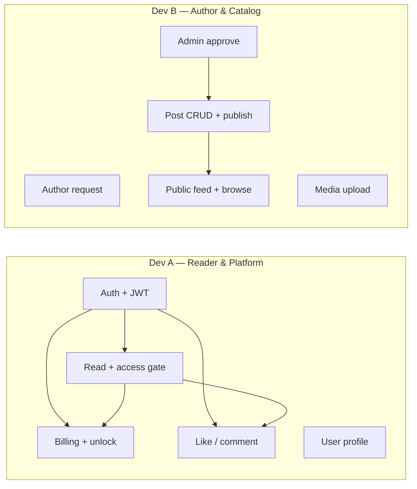

# MVP Feature Breakdown — 2 Developers

Feature-wise work split for **Prokash Digital MVP** (posts-only scope per [db-design-mvp.md](./db-design-mvp.md)).

---

## Legend

| Symbol | Meaning |
|--------|---------|
| **Dev A** | Reader path — auth, pay, read, engage |
| **Dev B** | Author path — content, catalog, admin |
| **Both** | Shared setup or integration |

---

## Developer Split Overview



---

## Feature 1: Platform Setup

**Owner: Both** · **When: Day 1–2**

| # | Task | Dev A | Dev B |
|---|------|:-----:|:-----:|
| 1.1 | Pull latest `develop`, verify app starts | ✓ | ✓ |
| 1.2 | PostgreSQL + Redis via Docker Compose | ✓ | ✓ |
| 1.3 | Run Flyway migrations, verify schema | ✓ | ✓ |
| 1.4 | Agree API error format + response wrapper | ✓ | ✓ |
| 1.5 | Pick editor JSON format (TipTap vs Editor.js) | ✓ | ✓ |
| 1.6 | Swagger / OpenAPI setup | ✓ | ✓ |

**Done when:** App starts, DB migrated, both devs can run locally.

---

## Feature 2: Registration & OTP

**Owner: Dev A** · **Status: Partially done**

| # | Task | API |
|---|------|-----|
| 2.1 | Sign up (phone, name, password) | `POST /api/v1/auth/signup` ✅ |
| 2.2 | Mock OTP verify | `POST /api/v1/auth/verify-otp` ✅ |
| 2.3 | Phone format validation (BD) | — |
| 2.4 | Password rules validation | — |
| 2.5 | Create wallet on verify (balance 0) | internal |
| 2.6 | Integration tests | — |

**Dev B:** None (wait for JWT in Feature 3).

---

## Feature 3: Login & JWT Sessions

**Owner: Dev A** · **Priority: #1 — blocks most work**

| # | Task | API |
|---|------|-----|
| 3.1 | Login (phone + password) | `POST /api/v1/auth/login` |
| 3.2 | Issue JWT access token (15 min) | — |
| 3.3 | Issue refresh token → Redis (30 days) | — |
| 3.4 | Refresh token rotation | `POST /api/v1/auth/refresh` |
| 3.5 | Logout (revoke refresh + blacklist JWT) | `POST /api/v1/auth/logout` |
| 3.6 | JWT filter in SecurityConfig | — |
| 3.7 | `@CurrentUser` helper / security context | — |
| 3.8 | Role checks: `READER`, `AUTHOR`, `ADMIN` | — |

**Public routes (no JWT):**

- All `/api/v1/auth/**`
- `GET /api/v1/posts/**` (public catalog — Dev B)

**Done when:** Frontend can login and call protected APIs.

---

## Feature 4: User Profile

**Owner: Dev A**

| # | Task | API |
|---|------|-----|
| 4.1 | Get my profile | `GET /api/v1/users/me` |
| 4.2 | Update name, email, bio, avatar URL | `PATCH /api/v1/users/me` |
| 4.3 | Avatar upload (or URL from media service) | optional |
| 4.4 | MapStruct DTOs | — |

**Fields on `users`:** `full_name`, `email`, `avatar_url`, `bio`, `role`

---

## Feature 5: Author Request & Admin Approval

**Owner: Dev B**

| # | Task | API |
|---|------|-----|
| 5.1 | Submit author request | `POST /api/v1/author-requests` |
| 5.2 | `motivation` optional, `requested_pen_name` optional | — |
| 5.3 | One PENDING request per user | — |
| 5.4 | List pending requests (admin) | `GET /api/v1/admin/author-requests` |
| 5.5 | Approve request | `PATCH /api/v1/admin/author-requests/{id}/approve` |
| 5.6 | Reject request | `PATCH /api/v1/admin/author-requests/{id}/reject` |
| 5.7 | On approve → create `AuthorProfile`, set `role=AUTHOR` | — |
| 5.8 | Copy `requested_pen_name` → `pen_name` if provided | — |

**Depends on:** Feature 3 (JWT + ADMIN role).

---

## Feature 6: Author Profile

**Owner: Dev B**

| # | Task | API |
|---|------|-----|
| 6.1 | Get my author profile | `GET /api/v1/authors/me` |
| 6.2 | Update pen name, biography, payout phone | `PATCH /api/v1/authors/me` |
| 6.3 | Public author page | `GET /api/v1/authors/{idOrSlug}` |
| 6.4 | Display name rule: `pen_name ?? full_name` | — |

---

## Feature 7: Post Studio (Author CRUD)

**Owner: Dev B**

| # | Task | API |
|---|------|-----|
| 7.1 | Create draft post | `POST /api/v1/author/posts` |
| 7.2 | Edit post (title, body, excerpt, preview_body) | `PUT /api/v1/author/posts/{id}` |
| 7.3 | Soft delete post | `DELETE /api/v1/author/posts/{id}` |
| 7.4 | List my posts (draft + published) | `GET /api/v1/author/posts` |
| 7.5 | Set pricing: FREE / LOCKED + price (≥ 1 BDT) | — |
| 7.6 | Auto-generate slug from title | — |
| 7.7 | Sync `body_plain_text` from JSON body | — |
| 7.8 | AUTHOR role guard on all routes | — |

**Depends on:** Feature 3 + Feature 5 (approved author).

---

## Feature 8: Publish Post

**Owner: Dev B**

| # | Task | API |
|---|------|-----|
| 8.1 | Publish draft → PUBLISHED | `POST /api/v1/author/posts/{id}/publish` |
| 8.2 | Set `published_at` | — |
| 8.3 | Validation: body not empty, locked has price | — |
| 8.4 | Unpublish (optional MVP) | `POST /api/v1/author/posts/{id}/unpublish` |

---

## Feature 9: Tags

**Owner: Dev B**

| # | Task | API |
|---|------|-----|
| 9.1 | Seed default tags (Fiction, Poetry, etc.) | migration/seed |
| 9.2 | List all tags | `GET /api/v1/tags` |
| 9.3 | Assign tags to post | `PUT /api/v1/author/posts/{id}/tags` |
| 9.4 | Filter feed by tag | `GET /api/v1/posts?tag=fiction` |

---

## Feature 10: Media Upload

**Owner: Dev B**

| # | Task | API |
|---|------|-----|
| 10.1 | Upload image (max 5MB) | `POST /api/v1/author/media` |
| 10.2 | Store in MinIO or local `/uploads` for MVP | — |
| 10.3 | Return URL for editor embed | — |
| 10.4 | Link media to post on save | — |

---

## Feature 11: Public Catalog & Feed

**Owner: Dev B** · **Can start early (public routes)**

| # | Task | API |
|---|------|-----|
| 11.1 | Public feed (published posts, paginated) | `GET /api/v1/posts` |
| 11.2 | Sort by `published_at DESC` | — |
| 11.3 | Post card: title, excerpt, author, price, cover | — |
| 11.4 | Post detail (metadata only) | `GET /api/v1/posts/{slug}` |
| 11.5 | Show `isLocked`, `price`, `hasPurchased` (if logged in) | — |
| 11.6 | Basic search | `GET /api/v1/posts?q=` |
| 11.7 | Increment `view_count` (debounced) | — |

**Note:** Do **not** return full `body` here — that is Feature 12.

---

## Feature 12: Content Reading & Access Control

**Owner: Dev A** · **Core paywall logic**

| # | Task | API |
|---|------|-----|
| 12.1 | `ContentAccessService` — single source of truth | internal |
| 12.2 | Rules: FREE → full; LOCKED + no unlock → preview; LOCKED + unlock → full | — |
| 12.3 | Read content endpoint | `GET /api/v1/posts/{slug}/content` |
| 12.4 | Response: `accessLevel`, `body` or `preview_body` | — |
| 12.5 | Guest can read FREE + preview only | — |
| 12.6 | Check `content_unlocks` for logged-in user | — |

**Access matrix:**

| User | Free post | Locked (not bought) | Locked (bought) |
|------|-----------|---------------------|-----------------|
| Guest | Full | Preview | Preview |
| Logged in | Full | Preview | Full |

**Depends on:** Feature 11 (slug exists), Feature 3 (optional for purchase check).

---

## Feature 13: Payment & Unlock

**Owner: Dev A**

| # | Task | API |
|---|------|-----|
| 13.1 | Initiate checkout for locked post | `POST /api/v1/billing/posts/{postId}/checkout` |
| 13.2 | Create `payment_transactions` (PENDING) | — |
| 13.3 | Mock SSLCommerz redirect URL | — |
| 13.4 | Webhook / success callback | `POST /api/v1/billing/webhook/sslcommerz` |
| 13.5 | On SUCCESS → insert `content_unlocks` | — |
| 13.6 | Idempotency-Key header | — |
| 13.7 | List my purchases | `GET /api/v1/billing/unlocks` |

**Depends on:** Feature 3 + Feature 12.

**Out of scope for MVP:** wallet top-up, ledger splits, author payouts.

---

## Feature 14: Likes

**Owner: Dev A**

| # | Task | API |
|---|------|-----|
| 14.1 | Like post (FULL access only) | `POST /api/v1/posts/{id}/likes` |
| 14.2 | Unlike post | `DELETE /api/v1/posts/{id}/likes` |
| 14.3 | Reject if preview-only access | 403 |
| 14.4 | Update `posts.like_count` | — |
| 14.5 | Check if current user liked | in post detail response |

**Depends on:** Feature 12 (access gate).

---

## Feature 15: Comments

**Owner: Dev A**

| # | Task | API |
|---|------|-----|
| 15.1 | List comments on post | `GET /api/v1/posts/{id}/comments` |
| 15.2 | Add comment (FULL access only) | `POST /api/v1/posts/{id}/comments` |
| 15.3 | Soft delete own comment | `DELETE /api/v1/comments/{id}` |
| 15.4 | Optional: reply (`parent_id`) | — |
| 15.5 | Update `posts.comment_count` | — |

**Depends on:** Feature 12.

---

## Feature 16: Reading Progress

**Owner: Dev A** · **Priority: Low (nice-to-have)**

| # | Task | API |
|---|------|-----|
| 16.1 | Save scroll position | `PUT /api/v1/posts/{id}/progress` |
| 16.2 | Get progress | `GET /api/v1/posts/{id}/progress` |
| 16.3 | Only for FULL access posts | — |

Skip if Week 3 is tight.

---

## Feature 17: Admin Tools

**Owner: Dev B**

| # | Task | API |
|---|------|-----|
| 17.1 | Author request queue | Feature 5 |
| 17.2 | Flag post UNDER_REVIEW (optional) | `PATCH /api/v1/admin/posts/{id}/review` |
| 17.3 | Deactivate author | `PATCH /api/v1/admin/authors/{id}/deactivate` |

---

## Summary: Who Owns What

| Feature | Name | Dev A | Dev B |
|---------|------|:-----:|:-----:|
| 1 | Platform setup | Both | Both |
| 2 | Registration & OTP | ✅ | — |
| 3 | Login & JWT | ✅ | — |
| 4 | User profile | ✅ | — |
| 5 | Author request & admin | — | ✅ |
| 6 | Author profile | — | ✅ |
| 7 | Post studio (CRUD) | — | ✅ |
| 8 | Publish post | — | ✅ |
| 9 | Tags | — | ✅ |
| 10 | Media upload | — | ✅ |
| 11 | Public catalog & feed | — | ✅ |
| 12 | Content reading & access | ✅ | — |
| 13 | Payment & unlock | ✅ | — |
| 14 | Likes | ✅ | — |
| 15 | Comments | ✅ | — |
| 16 | Reading progress | ✅ | — |
| 17 | Admin tools | — | ✅ |

---

## Suggested Timeline

### Week 1

| Dev A | Dev B |
|-------|-------|
| Feature 3: JWT login | Feature 7–8: Post CRUD + publish (with test auth) |
| Feature 4: Profile | Feature 5–6: Author request + profile |
| Feature 2: Harden signup | Feature 11: Public feed (start) |

### Week 2

| Dev A | Dev B |
|-------|-------|
| Feature 12: Access control | Feature 9–10: Tags + media |
| Feature 13: Payment & unlock | Feature 11: Finish feed + search |
| Feature 14–15: Like + comment | Feature 17: Admin polish |

### Week 3

| Dev A | Dev B |
|-------|-------|
| Feature 16 (if time) | Bug fixes, validation |
| Integration tests | Seed data, Swagger |
| **Both:** End-to-end demo + staging deploy | |

---

## Dependency Order

```
1. Feature 1 (env)
2. Feature 3 (JWT)           ← blocks protected APIs
3. Feature 5 + 7 (author)    ← parallel after JWT
4. Feature 11 (public feed)  ← can start early
5. Feature 12 (access gate)  ← before billing/social
6. Feature 13 (payment)
7. Feature 14–15 (social)
8. Integration + frontend
```

---

## Integration Points (sync daily)

1. **Post DTO shape** — Dev B defines; Dev A consumes for read/billing/social.
2. **`ContentAccessService`** — Dev A owns; Dev B calls it from catalog if needed.
3. **`accessLevel: PREVIEW | FULL`** — shared enum in API responses.
4. **Error codes** — `CONTENT_LOCKED`, `PURCHASE_REQUIRED`, `AUTHOR_REQUIRED`.

---

## MVP Demo Script (acceptance test)

1. Guest opens site → sees feed (**Dev B**)
2. Opens locked post → sees preview only (**Dev A + B**)
3. User signs up → verifies OTP → logs in (**Dev A**)
4. User submits author request → admin approves (**Dev B**)
5. Author publishes locked post at ৳50 (**Dev B**)
6. Reader buys post → sees full content (**Dev A**)
7. Reader likes and comments (**Dev A**)
8. Guest on free post → reads + likes after login (**Dev A + B**)

---

## Explicitly Out of MVP Scope

- Books & chapters
- Wallet top-up + double-entry ledger
- Dynamic watermark / page-by-page DRM
- Author earnings dashboard & payouts
- Elasticsearch, affiliate, B2B, analytics funnel
- Follow authors / library shelf
- Real SMS OTP (keep mock `123456`)

---

*Prokash Digital MVP · Feature breakdown · See also [db-design-mvp.md](./db-design-mvp.md)*
