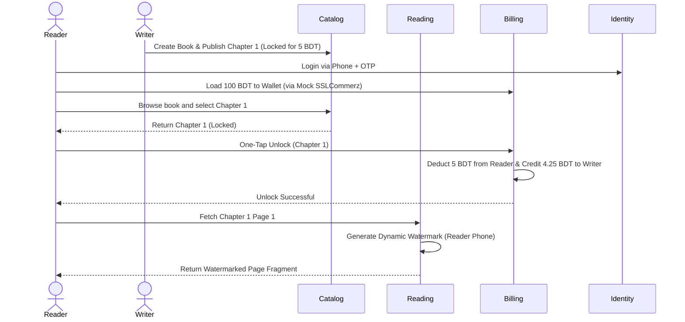

# Prokash Digital: MVP Feature List (Writer-First Focus)

This document outlines the scope of the first Minimal Viable Product (MVP) for **Prokash Digital**, focusing primarily on individual writers ("Sudo-Writers") paywalling their content and readers unlocking chapters.

---

## 1. Module Scope & Feature breakdown

### A. Identity Module (`identity`)
Handles user authentication and profile separation (Reader vs. Author).

* **BD Phone-Number Authentication**:
  - Sign up & Login using Bangladeshi phone numbers (`+8801xxxxxxxxx`) and passwords.
  - Mock Phone OTP flow (verifies OTP code via endpoint, ready to link to SMS gateways later).
* **Role-Based Profiles**:
  - Every account starts with a basic `ReaderProfile`.
  - Readers can toggle and create an `AuthorProfile` (defining pen name, bio, and bank/payout details).
* **Session Management**:
  - Stateless JWT sessions (Access Token + rotating Refresh Token).

---

### B. Catalog Module (`catalog`)
Manages structured books, stand-alone posts, categorization, and content creation tools.

* **Unified Content Types (Books, Chapters, and Stand-alone Posts)**:
  - **Structured Writing**: Authors can create a `Book` containing multiple sequential `Chapters` (ideal for long-form novels/essays).
  - **Social-Style Posts**: Authors can write standalone posts, articles, or "mind thoughts" directly without needing a book context. These are formatted simply (like a Facebook post or medium-length article) for quick, direct interaction.
  - **Flexible Pricing**: Any piece of writing (a chapter or a standalone post) can be set as **Free** or **Locked (Price in BDT)**.
* **Studio Editor (Rich Text Tooling)**:
  - A rich-text editor supporting custom formatting: headings, custom fonts (for Bangla script styling), lists, alignment, and inline image/embed insertions.
  - Stores content body in a structured JSON or HTML payload (compatible with modern editors like TipTap or Editor.js) to preserve exact design layout.
* **Flexible Categorization (Tagging)**:
  - Support for linking content to tags or genres (e.g., *Fiction*, *Short Story*, *Daily Thought*, *Poetry*).
  - **Pre- or Post-Categorization**: Writers can publish posts/books without categorization, and have the flexibility to add, update, or reorganize categories at any time in the future.
* **Browsing & Feed APIs**:
  - **Social Feed**: A chronologically sorted feed of stand-alone posts and newly published chapters from followed writers.
  - **Book Catalog List**: Endpoints for readers to search, filter, and discover books and standalone writings.

---

### C. Reading Module (`reading`)
Controls the delivery of reading content, page-by-page loading, and DRM protections.

* **Fragmented Page Loading API**:
  - Serves chapter content page-by-page to the web reader on demand (never loading the whole book in browser memory).
* **Dynamic Watermarking**:
  - Text overlay engine that overlays the active reader's phone number and email across the text to discourage screenshots.
* **Reader Library**:
  - Readers can bookmark books to their "My Library" shelf.
  - Synced reading progress (saves the last read chapter and scroll position).

---

### D. Billing Module (`billing`)
Manages transactions, payment processing, and virtual wallets.

* **Prokash Wallet**:
  - In-app wallet where readers load credits (e.g., loading 100 BDT or 500 BDT).
  - Mock **SSLCommerz** checkout flow to simulate loading wallet credits.
* **One-Tap Unlock**:
  - Reader clicks "Unlock Chapter" -> deducts BDT from reader's wallet.
  - Updates chapter access permission for that reader.
* **Double-Entry Transaction Ledger**:
  - Writes immutable ledger entries for every transaction (debit reader wallet, credit platform fee, credit author earnings).
* **Author Earnings Dashboard API**:
  - Endpoints displaying the author's total wallet balance, total unlocked chapters, and payout history.

---

### E. Analytics Module (`analytics`)
Gathers data on readership patterns to lay the foundation for B2B scouting.

* **Basic Engagement Metrics**:
  - Tracks total read count per book/chapter.
* **Chapter Drop-Off Rate**:
  - Calculates percentage of readers who drop off between chapters (e.g., 100 readers started Chapter 1, but only 40 reached Chapter 3).

---

## 2. MVP Workflow Diagram

